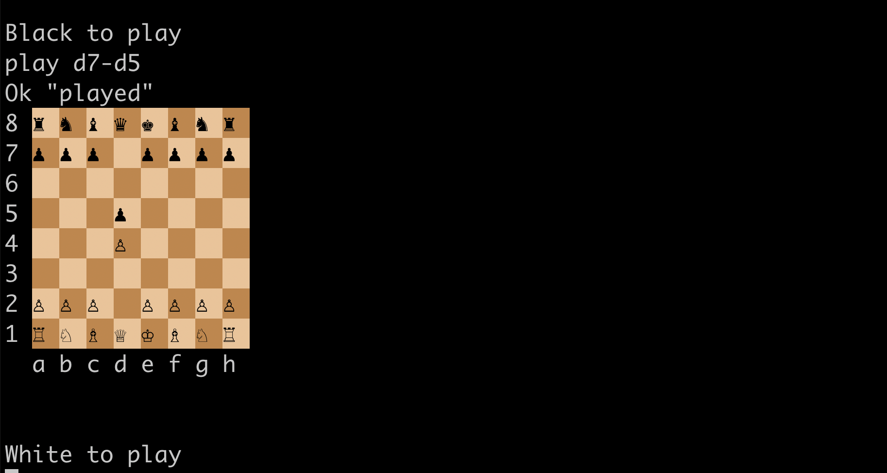
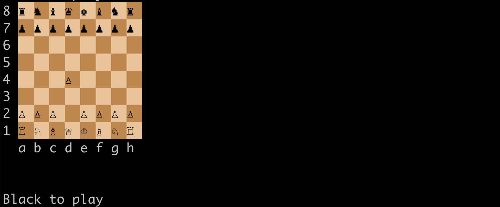

# Games on Hydra

An experiment to build distributed and decentralised games running on top of Cardano Layer 2, [Hydra](https://hydra.family).
This project started with [Black Jack](https://en.wikipedia.org/wiki/Blackjack) and then switched to focus on _Chess_ which is a much more interesting game.

> [!WARNING]
> This project is a work-in-progress and experimental, it's not meant (yet?) to be used for real playing on mainnet and it's advised to only run it on test networks.
> The code follows a duct-tape-and-staples design strategy which basically means I hack stuff until they work just enough to make some progress, then move on. Furthermore, it suffers from premature generalisation as I attempted to decouple from the interaction with the execution and settlement layer too early.

## Status

* [x] Rules [in PlutusTx](./black-jack-core/src/Chess/Game.hs) test-driven in [Haskell](./black-jack-core/test/Chess/GameSpec.hs)
* [x] Barebones Console based interface
* [x] ~~Mock server simulating lifecycle on Hydra (for testing purpose)~~
* [x] Basic [Plutus](./black-jack-core/src/Chess/Contract.hs) smart contract
* [x] Create Cardano transactions using only [cardano-cli](https://github.com/IntersectMBO/cardano-cli)
* [x] Advanced smart contract: Check play is valid for any given game state
* [ ] ~~Proper "randomness"~~
* [x] Startup & configure Hydra server in the background
* [x] Startup & configure cardano-node in the background
* [ ] Use mithril to bootstrap Cardano-node
* [x] Support for 2-players
* [ ] User manual
* [ ] Provide pre-compiled binaries
* [ ] Web UI

# Installation

> [!WARNING]
> The only tested and supported operating systems are currently Linux (and more precisely Debian-ish distros) and Mac OS X.
> There are of course plans to support other operating systems and in particular Windows.

The only currently supported method for installing hydra-chess is to build it from source.

## Build from source

*Requirements*:
* Haskell toolchain: Checkout [ghcup](https://www.haskell.org/ghcup/) which is a great tool to provision a Haskell toolchain. hydra-chess requires GHC 9.6 and Cabal 3.10
* System libraries: Install [libffi](https://sourceware.org/libffi/), [libiconv](https://www.gnu.org/software/libiconv/), and `libz`
* Custom libraries: `hydra-chess` still depends on some custom native libraries for compilation, checkout the [cardano-node installation](https://github.com/input-output-hk/cardano-node-wiki/blob/main/docs/getting-started/install.md) page for instructions on how to install those, in particular `libsodium` and `libsecp256k1`.

Assuming that all dependencies are installed, then do:

```
$ cabal install hydra-chess
```

to build all the components of `hydra-chess` and install binaries in the `~/.cabal/bin` directory.

# Usage

## Starting up

The main program is called `hychess` and is started with:

```
hychess --network <network name>
```

where `<network name>` argument is one of `Preview`, `Preprod`, or `Mainnet`.

`hychess` should automatically download a cardano-node, its
configuration files, start it, and then starts synchronizing,
displaying progress on the command-line. Note that first time
synchronisation will take some time, possibly a couple hours.

Then it does the same for hydra-node, downloading a pre-built binary,
configuring it, and starting it. On its first start, `hychess` will
create two dedicated pairs of Cardano Payment keys, one to drive the
Hydra protocol on-chain, and one to hold a _Game Token_ and some funds
used as collateral to drive the game itself.

Should everything goes well, one should end up with the following output in their terminal

```
Cardano|Synced    ▶
Hydra  |Started   ▶
Chess  |Started   ▶
>
```

## Playing

The command-line interface provides a very limited set of commands to play chess.
Typing `help` at the prompt will list them:

* `init` : Starts a new game session opening a Hydra head (can take a while)
* `newGame` : Starts a new game when head is opened or a game concludes with
      a check-mate. Displays the initial board.
* `play <from>-<to>` : move a piece on the board `<from>` some location `<to>`
      some other location. `<from>` and `<to>` are denoted using cartesian
      coordinates, for example:

      > play d2-d4"

      Displays updated board upon validation of the move
* `stop` : Stops the current game session, closing the Hydre head (can take a while)
* `quit` : Quits hydra-chess gracefully (`Ctrl-D` or `Ctrl-C` also work)

The normal sequence of operation is therefore to: `init` the head and
game session, starts a `newGame`, `play` the game until completion,
eg. check-mate for one of the players, then possibly do more `newGame`s, and
finally `stop` to close the head and `quit` to exit.

If things go well, one should see in their terminal the initial board:



Moving a piece updates the board after it's processed in the Head:



## Connecting to other players

By default hydra-chess runs in "solo" mode allowing one to play both
sides. While this is nice for testing, it's definitely much more fun
to play remotely with a partner. After all, disintermediated
peer-to-peer computing is the whole purpose of Cardano and blockchain!

> [!WARNING]
> The process of connecting 2 players is currently very
> annoying and manually intensive. This will of course be improved in
> future versions of hydra-chess

To connect with another player, one needs to configure a file named  `peers.json` which looks like:

```
[
    {
        "name": "somename",
        "address": {
            "host": "192.168.1.140",
            "port": 5551
        },
        "cardanoKey": "582068b950cd549a80b011a1ce7f6f384de0788cca685e24058e196ab450a7076989",
        "hydraKey": "582018b42eb2fca922c893521b90386c00f32710888362138cc137c10b292eb8815c"
    }
]
```

This file should be placed in a directory named after the cardano network used under one's home directory:

* `hychess --network Preview` :point_right: `~/.config/hydra-chess/preview/`
* `hychess --network Preprod` :point_right: `~/.config/hydra-chess/preprod/`
* ...

This file defines the information needed to connect to one or more peers (should be only one in the case of Chess):
* The IP and TCP port of the remote peer
  > The port is currently hardcoded to be 5551
* The base16 CBOR-encoded Cardano verification key of the peer.
  > This corresponds to the `cborHex` field of the configuration file `~/.config/hydra-chess/preview/cardano.vk`,
* The base16 CBOR-encoded Hydra verification key of the peer.
  > This corresponds to the `cborHex` field of the configuration file `~/.config/hydra-chess/preview/hydra.vk`,

Therefore the process to connect to a peer is currently the following (assuming network used is `Preview`):
1. Start `hychess` on some network at least once in order to generate
   needed data,
2. Put the relevant information for one's node into a JSON formatted
   file, retrieving the data as explained in the previous paragraph,
3. Ensure one's firewall is properly configured to enable incoming and
   outgoing connections from the remote peer,
4. Share the content of the file with the peer,
5. Put the peer's information into a
   `~/.config/hydra-chess/preview/peers.json` file,
6. **Stop** hychess,
7. Remove the content of the `~/.cache/hydra-chess/preview/` directory
   which contains the state of hydra-node

   > Not doing this will result in an error upon node's restart as the
   > peers configuration will have changed
8. Restart `hychess`

## Troubleshooting

`hychess` keeps a log of messages from cardano-node, hydra-node, and
hychess processes. Those logs are placed respectively in:
* `cardano-node` :arrow_right: `~/.cache/hydra-chess/preview/cardano-node.log`,
* `hydra-node` :arrow_right: `~/.cache/hydra-chess/preview/hydra-node.log`,
* `hychess` :arrow_right: `~/.cache/hydra-chess/preview/game.log`.

# Why?

The ability to play games in a safe and decentralised way is one
possible use case of blockchains. However, Layer 1 is way too
expensive and slow to enable a good gaming experience, hence the need
to rely on Layer 2 to speed things up and make it cheap and affordable
to play games with other people.

Having contributed to [Hydra](https://hydra.family) since its
inception, I also wanted to start experimenting with how one could
build such a system and application to make it reasonably easy to use
Hydra for gaming purpose.

The [Experience Report](./2023-experience-report.md) contains some
thoughts about Cardano, Hydra, DApps development, stemming from this
experiment.
